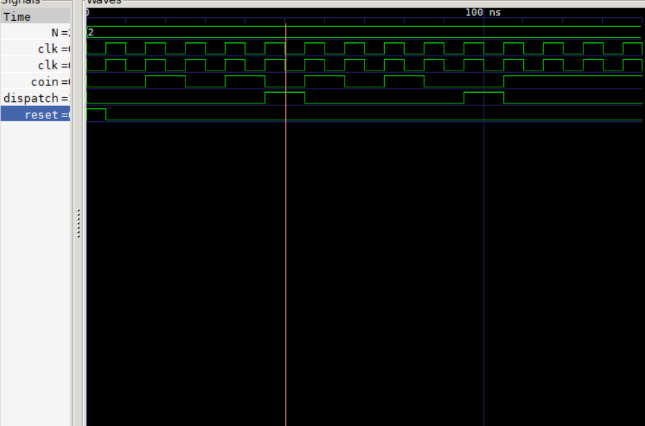

#  Simple Vending Machine FSM (Verilog)

## Overview

This project implements a **Finite State Machine (FSM)** in Verilog to simulate a simple vending machine. The machine accepts coins and dispenses a product once a fixed credit threshold is reached.

The design follows a  **Moore machine architecture** , where outputs depend only on the current state.

---



##  Features

* Coin-based credit accumulation
* Automatic product dispatch after required coins
* FSM-based control logic
* Fully testbench-driven simulation
* Waveform generation using VCD (for GTKWave)

---

##  FSM Design

### States

The FSM tracks the number of inserted coins:

| State | Description        |
| ----- | ------------------ |
| S0    | 0 coins            |
| S1    | 1 coin             |
| S2    | 2 coins            |
| S3    | 3 coins (Dispense) |

---

### State Transitions

| Current State | Input (coin) | Next State |
| ------------- | ------------ | ---------- |
| S0            | 0            | S0         |
| S0            | 1            | S1         |
| S1            | 0            | S1         |
| S1            | 1            | S2         |
| S2            | 0            | S2         |
| S2            | 1            | S3         |
| S3            | X            | S0         |

---

### Output Logic (Moore)

* `dispatch = 1` only in **S3**
* Otherwise `dispatch = 0`

---

##  Project Structure

```text
.
├── Simple_vending_machine.v      # FSM design (DUT)
├── Simple_vending_machine_tb.v   # Testbench
├── vending_machine.vcd           # Simulation waveform (generated)
└── README.md                     # Project documentation
```

---

## 🔌 Module Interface

```verilog
module Simple_vending_machine (
    input clk,
    input reset,
    input coin,
    output reg dispatch
);
```

---

##  Testbench Details

The testbench:

* Generates a clock signal
* Applies reset
* Simulates coin insertion
* Dumps waveform for analysis

### Clock Generation

```verilog
initial clk = 0;
always #5 clk = ~clk;
```

---

##  Simulation Instructions

### Using Icarus Verilog

```bash
iverilog -o vending_tb Simple_vending_machine.v Simple_vending_machine_tb.v
vvp vending_tb
```

### View Waveform (GTKWave)

```bash
gtkwave vending_machine.vcd
```

---

##  Expected Behavior

* Each coin increments the FSM state
* After 3 coins → system enters **S3**
* `dispatch` signal goes HIGH for one cycle
* FSM resets to S0

---

##  Future Improvements

* Multi-product selection
* Variable pricing system
* Change return mechanism
* Display interface (7-segment/LCD)
* Mealy machine optimization
* FPGA deployment (Vivado/Quartus)

---

## Key Concepts Learned

* FSM design (Moore machine)
* State encoding and transitions
* Sequential vs combinational logic
* Verilog RTL modeling
* Testbench development
* Simulation and waveform analysis

---

##  License

This project is open-source and free to use for educational purposes.

---

##  Author

**Odari Charles**
Electrical & Electronics Engineering Student
Interested in Embedded Systems, FPGA Design, and Digital Systems

---
